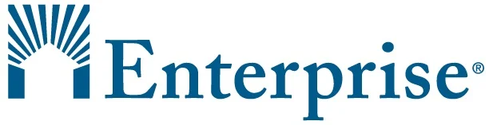

# AI Case Study: Enterprise Community Partners

## Table of Contents
1. [Overview and Origin](#overview-and-origin)
    * [Funding Allocation Overview](#funding-allocation-overview)
2. [Business Activities](#business-activities)
3. [Landscape](#landscape)
    * [Technological Innovations Shaping Housing](#technological-innovations-shaping-housing)
4. [Results](#results)
    * [Comparison of AI Utilization Across Nonprofits](#comparison-of-ai-utilization-across-nonprofits)
5. [Recommendations](#recommendations)
    * [Recommendation 1: AI-Powered Resident Engagement Platform](#recommendation-1-ai-powered-resident-engagement-platform)
    * [Recommendation 2: Enhanced Predictive Analytics for Construction Planning](#recommendation-2-enhanced-predictive-analytics-for-construction-planning)
    * [Recommendation 3: AI-Driven Impact Evaluation Tools](#recommendation-3-ai-driven-impact-evaluation-tools)
6. [Sources](#sources)

---

## Overview and Origin

* **Name of Company:** Enterprise Community Partners
* **Incorporation:** Founded in 1982
* **Founders:** James Rouse and Patty Rouse
* **How the Idea Came About:** The Rouses founded Enterprise with a mission to tackle housing inequality by creating affordable housing for underserved communities. They aimed to address housing insecurity while promoting racial and economic equity, focusing on empowering communities to achieve long-term stability.
* **Funding and Allocation:** Enterprise, a 501(c)(3) nonprofit, is funded through philanthropic grants, corporate donations, and investments. Key partnerships, such as with the Wells Fargo Foundation, have helped raise over $53 billion, supporting extensive community and housing projects. Funds are allocated across housing construction, community development, and resident support programs, prioritizing initiatives that address both immediate needs and the long-term stability of communities.

### **Funding Allocation Overview**
Enterprise strategically allocates its funds to affordable housing projects, which often include health, resilience, and economic mobility initiatives. Additional funds are used for research, capacity building, and technical assistance for local nonprofits, ensuring a comprehensive approach to community development.

## Business Activities

* **Problem Solved:** Enterprise addresses the national affordable housing shortage, especially impacting low-income families and marginalized communities. By integrating health, resilience, and economic mobility initiatives into housing solutions, Enterprise not only provides homes but also builds sustainable, empowered communities.
* **Target Audience and Market Size:** Enterprise’s target audience includes low-income families and marginalized communities. The need for affordable housing is vast, with over 10 million renters in the U.S. spending more than half their income on rent.
* **Unique Solution/Unfair Advantage:** Enterprise uses AI-driven predictive analytics to forecast housing needs and optimize resource allocation, allowing them to tackle the housing crisis more proactively. Programs like the Housing Affordability Breakthrough Challenge, in partnership with Wells Fargo, exemplify their commitment to AI innovation in housing construction, financing, and other critical areas.
* **Technologies Used:** AI, machine learning, and predictive analytics are integrated into Enterprise’s project management systems, enhancing data analysis and decision-making. These tools streamline operations, identify high-need areas, and optimize funding distribution, enabling a responsive and effective approach to affordable housing.

## Landscape

* **Field:** Affordable housing and community development
* **Major Trends (Last 5–10 Years):** The affordable housing sector has increasingly embraced technology, with innovations like AI-based urban planning, sustainable construction, and predictive models for housing demand. COVID-19 highlighted the need for data-driven responses to housing shortages, accelerating the adoption of AI across the sector.
* **Technological Innovations Shaping Housing:** Advancements in AI-driven urban planning enable data-backed community assessments and customized planning. Sustainable construction methods, like 3D-printed structures and modular housing, provide affordable alternatives, adding flexibility to housing projects. Enterprise’s ability to integrate these technologies enhances their competitive edge.
* **Competitors:** Major competitors include LISC (Local Initiatives Support Corporation), NeighborWorks America, and Mercy Housing. Although these nonprofits share similar goals, Enterprise’s AI-driven predictive analytics allow for more agile responses to housing crises, setting them apart in resource allocation and crisis response.

## Results

* **Business Impact:** AI has empowered Enterprise to scale operations effectively, ensuring that their resources target underserved communities efficiently. As a result, they’ve developed and preserved over 662,000 affordable homes, investing billions into community revitalization. AI-driven analysis of housing trends and needs has been pivotal in achieving these outcomes.
* **Core Metrics:** Key metrics include the number of housing units developed, families served, and total financial investments in community projects. To date, Enterprise has invested over $53 billion, solidifying its leadership in the nonprofit housing sector.
* **Comparison to Competitors:** Compared to organizations like LISC, Enterprise’s deep investment in AI gives them a unique advantage. While competitors also utilize data, Enterprise’s predictive capabilities enable rapid adjustments in response to market changes, improving efficiency and scalability.

### **Sample Data Visualizations**

**Homeownership Rate**  
  

**Rental Vacancy Rate**  
  

**Residential Mortgages and Consumer Credit as % of Disposable Income**  
  

**Real Median Household Income**  
  

**Median Sales Price of Houses Sold**  
  

## Recommendations

From my perspective at LISC, I’ve seen the positive impact AI can have in the affordable housing sector. Enterprise’s success with AI inspires us to explore similar strategies for maximizing LISC’s ability to meet housing needs.

### **Recommendation 1: AI-Powered Resident Engagement Platform**

* **Proposal:** Enterprise should expand its AI capabilities by developing a resident engagement platform offering financial counseling, job training, and social support.
  
* **Benefits:** While Enterprise’s AI tools are effective in resource allocation, extending these capabilities to tenant engagement would deepen their impact. This platform could provide tenants with personalized guidance, directly aligning with Enterprise’s mission to foster economic mobility within housing communities.
* **Challenges:** Implementing this platform would require a substantial investment in data collection, security, and staff training. Ensuring scalability and data privacy will be essential.
* **Technologies Utilized:** The platform could utilize natural language processing (NLP) and machine learning algorithms. An AI chatbot could assist residents in finding financial resources or job opportunities, while machine learning refines recommendations over time.
* **Appropriateness of Technologies:** AI’s scalability makes it ideal for managing resident data and providing real-time, personalized assistance across communities.

### **Recommendation 2: Enhanced Predictive Analytics for Construction Planning**

* **Proposal:** Enterprise could further refine its predictive analytics for construction planning, enabling them to anticipate delays, material shortages, and budget fluctuations to keep projects on track.
  
* **Benefits:** Affordable housing construction often faces delays due to factors like labor shortages or fluctuating material costs. Predictive analytics would allow Enterprise to foresee these issues and make adjustments, reducing costs and increasing project completion rates.
* **Challenges:** Scaling these models would require additional training and investment in specialized software. Continuous model refinement is necessary to maintain accuracy as market conditions evolve.
* **Technologies Utilized:** Advanced machine learning models could analyze historical data to predict project risks. Integrated scheduling tools would provide real-time updates, enabling teams to adjust plans as needed.
* **Appropriateness of Technologies:** Machine learning’s ability to detect patterns makes it ideal for predictive analytics in construction, ensuring efficient project execution.

### **Recommendation 3: AI-Driven Impact Evaluation Tools**

* **Proposal:** Enterprise should consider using AI tools to evaluate long-term social and economic impacts, quantifying the benefits of their housing projects on residents.
  
* **Benefits:** Nonprofits often struggle to measure social impact. AI-driven evaluation tools could help Enterprise demonstrate its value to funders while identifying improvement areas for future projects.
* **Challenges:** Consistent data collection and privacy protection are essential, especially when tracking sensitive resident data. The cost and infrastructure needed to support continuous data processing should also be considered.
* **Technologies Utilized:** AI algorithms could track metrics like income growth and employment stability, identifying patterns that contribute to positive outcomes. Machine learning could also enhance these tools by refining them over time.
* **Appropriateness of Technologies:** AI’s analytical power makes it ideal for impact evaluation, as it can uncover correlations within large datasets, providing data-driven insights for continuous improvement.

## Sources

* [Enterprise Community Partners](https://www.enterprisecommunity.org/resources/power-innovation-building-better-more-equitable-housing-system)
* [Microsoft AI for Nonprofits](https://www.microsoft.com/en-us/nonprofits/empower-your-nonprofit-with-ai)
* [Nonprofit Hub on AI Capacity Building](https://nonprofithub.org/building-ai-capacity-in-nonprofits/)
* [AI and Affordable Housing](https://www.huduser.gov/portal/pdredge/pdr-edge-featd-article-022024.html)
* [Harvard Joint Center for Housing Studies: AI and Housing](https://www.jchs.harvard.edu/research/symposia-special-projects/bringing-digitalization-home-how-can-technology-address-housing)
